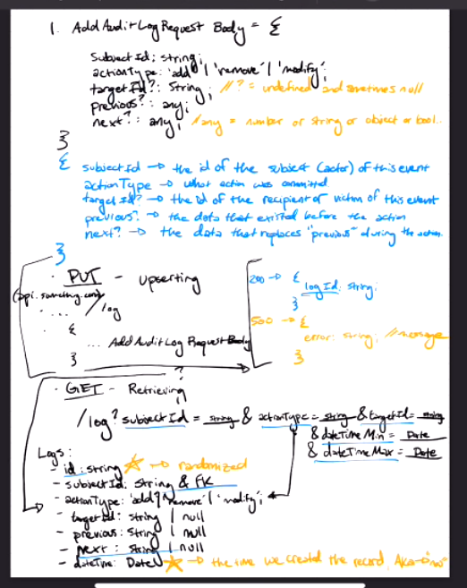

# Dynamic Audit Log Problem

## Attempt 0

### Notes

* Requirement 1:

    * AddAuditLogRequest Body = {

        subjectId: string; 																					   Id of the subject (actor) of this event

        actiontype: 'add'  | 'remove' | 'modify';													What is being done

        targetId?: string //? = undefined and sometimes null or optional		id of the recipient/victim of the event

        previous?: any;																						  the data that existed prior to the action

        next?: any;  //any = num/string/obj/boolean										   the data that replaces "previous" during action

        }

    * PUT - update/upserting (inserting or updating combo)

    * ..../log 

        {.... AddAuditLogRequestBody}

* Requirement 2: retrieving 

    * GET - retrieving (can include parameters to narrow down)
        * /log?subjectId=__&actionType=_ &... &dateTimeMin= __ / &dateTimeMax= __
    * Logs table(contains): 
        * id: string (randomized)
        * subjectId: string & Fk
        * actionType: 'add' | 'remove' | 'modify';
        * targetId: string | null;
        * prev: string | null;
        * next: string | null;
        * dateTime: Date; (time we created the record, "NOW")
    * picture



* Building a REST API checklist:
    * method (GET/PUT/POST/DELETE)
    * Route/path? (/log)
    * Request body (input, {add auditlog})
    * what are the valid repsonses? (200 / 500)


## Attempt 1

### Notes

* (as some app) design a DB schema for info provided (table)

* logs

    * id: string; (get randomized)
    * subjectId: string;
    * actionType: 'add' | 'remove' | 'modify';
    * targetId?: string;
    * prev?: any;
    * next?: any;
    * dateTime: Date;

* PUT - /log

    * `AddAuditLogRequestBody` 

    * responses: 200: {string: "success"}

        500 {string: error }

* GET /logs?Id=string&subjectId=string&actionType=string&targetId=string&dateTimeMin=string&dateTimeMax=string;

    * request: n/a

    * responses: 

        * 200

            * ```
                {
                	"id": "string",
                	"subjectId": "string",
                	"actionType": "add" | "remove" | "modify"
                	... (rest of what is stored in logs)
                }
                ```

        * 500

            * ``` 
                {
                	"error": "string"
                }
                ```

        * 404

            * ``` 
                {}
                ```

                


### Reflection

* Things DJ would do differently:

    * route should be plural, not singular

    * response would be an array of the objects, not *just* a single object

    * one of the parameters should be the id of the log 

        

* Things to improve on:

    * **GET does not have a request body**

    * Account/acknowledge other status codes- word choice issue

    * "we have the model provided" | "the request body would be the same as the data model" word choice issue

    * the column names for my SQL schema should be in snakecase, not camel (e.g action_type vs. actionType)

    * there is no "?" in SQL, instead use NULLABLE (e.g prev: any, NULLABLE)

        * ```
            create table <tablename> (
            
            id: varchar(50)
            subject_id: varchar(50)
            action_type: varchar(50)
            target_id: NULLABLE varchar(50)
            prev: NULLABLE BLOB
            next: NULLABLE BLOB
            created_at_dt: Date
            );
            ```
    
    * 

## Attempt 2

### Notes

* ``` 
    id: varchar(50)
    subject_id: varchar(50)
    action_type: varchar(50)
    target_id: NULLABLE varchar(50)
    prev: NULLABLE BLOB
    next: NULLABLE BLOB
    created_at_dt: Date
    ```

* GET/PUT/POST/DELETE

* GET- retrieve

* Put- upserting 

* Post- process

* delete

    * /audit/logs

    * ``` 
        {AddAuditRequestBody}
        ```

* 200

* ``` 
    {
    	"string": "success"
    }
    ```

* 500

* ```
    {
    	"error": "string"
    }
    ```


* **retrieve** logs. 

* /audit/logs?Id=string&subjectId=string&actionType=string&targetId=string&dateTimeMin=string&dateTimeMax=string

* 200

* ``` 
    {
    	"id": "string",
    	"subjectId": "string",
    	...
    }
    ```

* 500

* ``` 
    {
    	"error": "string"
    }
    ```

* 

### Reflection

* Don't forget the name of the table
* BLOB: Investigate more about SQL BLOB
* updated_at_dt: for future reference
* KNOW YOUR RESOURCE METHODS BY HEART. NO FLUBBING.
* Singular vs. plural for GET/PUT.
* PUT *can* be plural, GET SHOULD be plural
* Know WHY you're naming a path a certain way by heart
* can't use enums in sql, use varchar
* Investigate TS 


TS tasks to do:

* Hello world
* String randomizer
* fizzbuzz
